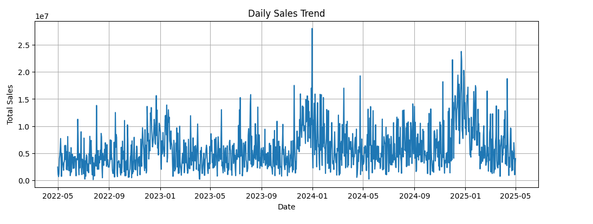
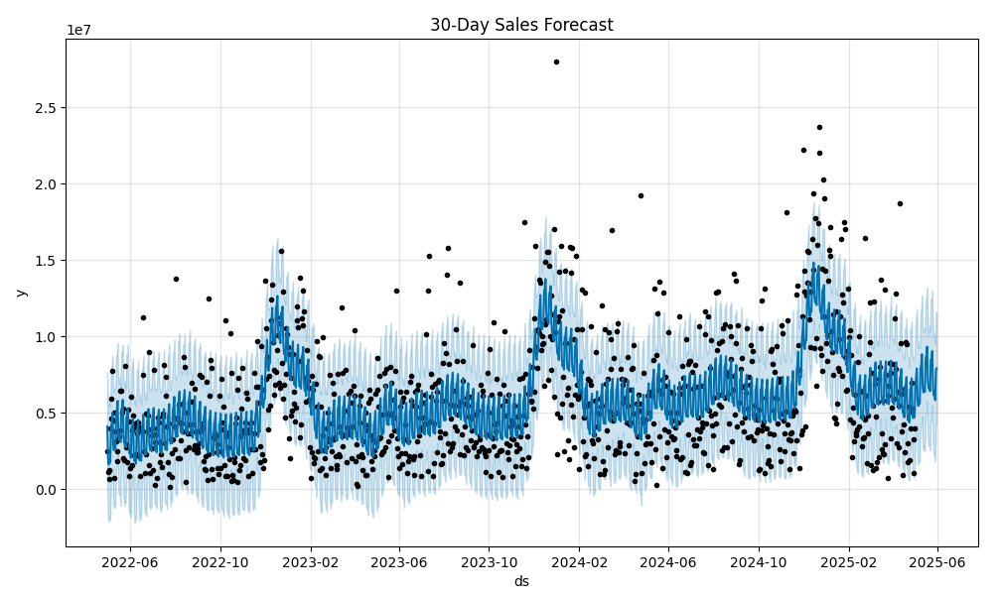

# Task 01 – AI-Powered Sales Forecasting Dashboard

## Objective
Build a dashboard that predicts future sales trends using historical dataset.

## Deliverables
- Time-series forecasting ML model
- Visualizations (trend, seasonality, prediction)
- Dataset file
- Notebook (.ipynb) with code
- Dashboard screenshot or deployment link

## Tools Recommended
Python, Pandas, Scikit-learn, Matplotlib, Prophet, Power BI (optional)

## 📊 Output Screenshots

### Daily Sales Trend

### 30-Day Sales Forecast

