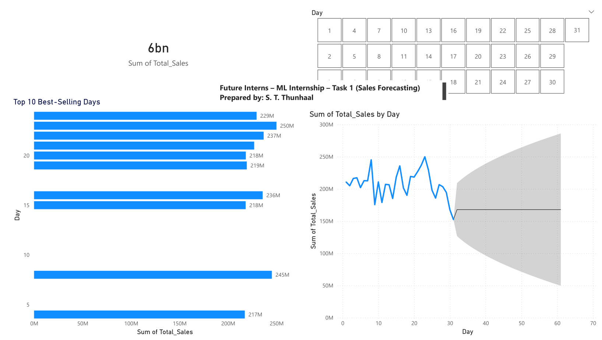

# Task 01 – Sales Forecasting (Machine Learning Internship – Future Interns)

This repository contains Task-01 of the Machine Learning Internship at **Future Interns**.  
The objective is to perform **time-series sales forecasting** using Instax camera sales transactions, visualize historical sales trends, and predict future demand using machine-learning models.

---

## 📌 Project Overview

Organizations rely on **data-driven forecasting** for inventory planning, supply-chain optimization, and profitability.  
In this task, we:

- Processed Instax camera transaction dataset
- Aggregated daily sales totals
- Visualized trend & seasonal patterns
- Implemented **Facebook Prophet** forecasting model
- Generated **next-30-day sales predictions**

---

## 🧠 Machine Learning Workflow

| Step | Description |
|------|-------------|
| 1️⃣ Data Import & Cleaning | Loaded `.csv` data and handled missing values |
| 2️⃣ Feature Engineering | Converted invoice-level data → daily grouped totals |
| 3️⃣ Visualization | Trend & seasonality plots using Matplotlib |
| 4️⃣ Forecasting Model | Applied Prophet on historical daily sales |
| 5️⃣ Output | Predicted next 30 days and exported results |

---

## 🛠️ Tools & Technologies Used

| Category | Tools |
|----------|-------|
| Programming | Python |
| ML Libraries | Pandas, NumPy, Matplotlib, Prophet |
| IDE / Notebook | Google Colab |
| Dashboard (optional) | Power BI / Tableau |

---

## 📊 Output Screenshots

### 📈 Daily Sales Trend

This graph shows the daily sales fluctuations and seasonal demand peaks over time, especially around November–January.

---

### 🔮 30-Day Sales Forecast

Prophet forecast output showing estimated demand for the next 30 days.  
The shaded region indicates upper–lower confidence ranges for prediction.

---

### 📊 Power BI Dashboard

---

## 📁 Repository Structure

Task_01_Sales_Forecasting/
│── Task_01_Sales_Forecasting.ipynb      # Notebook with ML pipeline
│── instax_sales_transaction_data.csv    # Raw dataset
│── sales_forecast_30days.csv            # Generated forecast output
│── Daily_Sales.png                      # Trend visualization
│── Task_01_Sales_Forecasting.pbix   ← upload this
│── dashboard.png
│── 30_Day_Forecast.png                  # Forecast visualization
│── README.md

---

## 📝 Conclusions & Learnings

From this task, I learned:

- Complete workflow of a **time-series forecasting project**
- Cleaning + aggregating raw business data is crucial before ML
- Visual patterns reveal **seasonality & business cycles**
- Forecasting assists in **inventory, marketing, and sales planning**

---

## 🚀 Future Enhancements

| Improvement | Idea |
|-------------|------|
| Dashboard | Build interactive BI report |
| Model comparison | Add ARIMA / SARIMA / LSTM vs Prophet |
| Deployment | Host model via Flask / FastAPI and expose prediction API |
---

## 🙋‍♂️ Author

**S. T. Thunhaal**  
Machine Learning Intern – Future Interns  
LinkedIn: [https://www.linkedin.com/in/thunhaal-st-041001319/](https://www.linkedin.com/in/thunhaal-st-041001319/)

---
